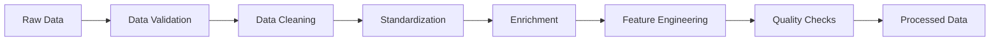
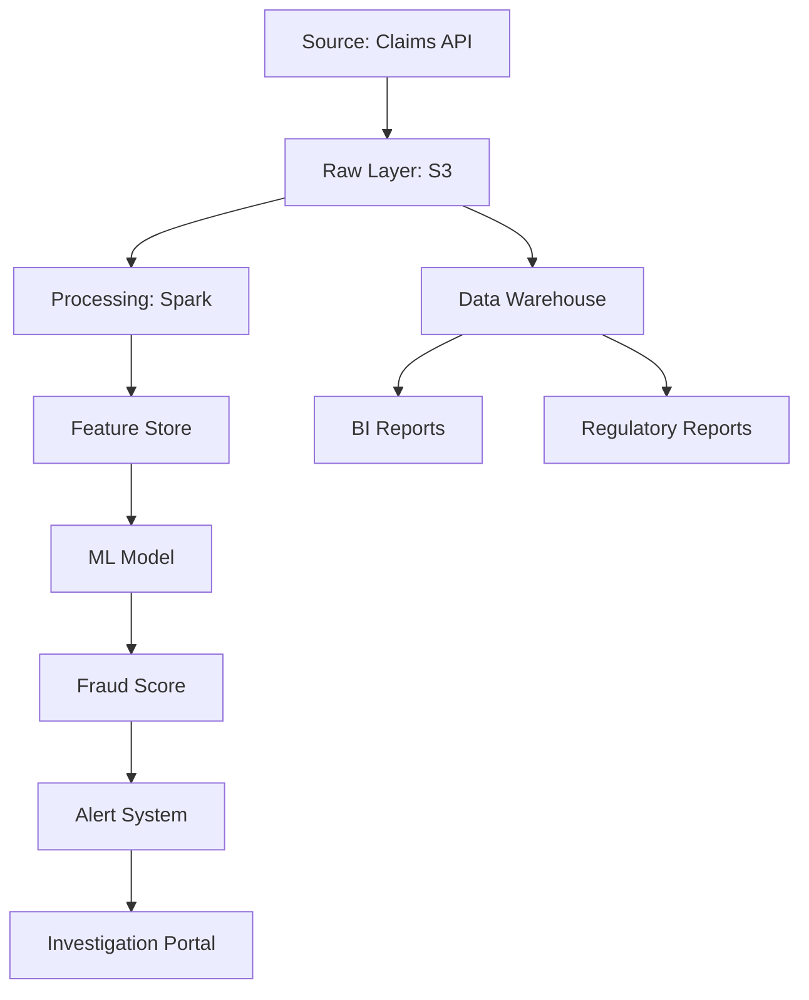

# Data Architecture - Insurance Claims Fraud Detection

## Overview

This document defines the data architecture for the insurance claims fraud detection system, covering data ingestion, storage, processing, and analytics layers. The architecture is designed to handle both batch and real-time processing while maintaining data quality, security, and compliance.

## Data Architecture Principles

1. **Data as an Asset**: All data is treated as a valuable organizational asset
2. **Single Source of Truth**: Each data element has one authoritative source
3. **Data Quality First**: Quality checks at every stage of the pipeline
4. **Privacy by Design**: PHI/PII protection built into the architecture
5. **Scalability**: Designed to handle exponential data growth
6. **Real-time Capable**: Support for both batch and streaming workflows

## Data Architecture Layers

```
┌─────────────────────────────────────────────────────────────┐
│                    Data Sources                              │
│  (Claims, Providers, Patients, External APIs)                │
└─────────────────────┬────────────────────────────────────────┘
                      │
┌─────────────────────▼────────────────────────────────────────┐
│                 Ingestion Layer                              │
│  (Kafka, API Gateway, SFTP, CDC)                            │
└─────────────────────┬────────────────────────────────────────┘
                      │
┌─────────────────────▼────────────────────────────────────────┐
│                 Raw Data Lake                                │
│  (S3/Azure Data Lake - Bronze Layer)                         │
└─────────────────────┬────────────────────────────────────────┘
                      │
┌─────────────────────▼────────────────────────────────────────┐
│              Processing Layer                                │
│  (Spark, Airflow, DBT - Silver Layer)                       │
└─────────────────────┬────────────────────────────────────────┘
                      │
┌─────────────────────▼────────────────────────────────────────┐
│              Feature Store & DW                              │
│  (Feature Store, Snowflake - Gold Layer)                     │
└─────────────────────┬────────────────────────────────────────┘
                      │
┌─────────────────────▼────────────────────────────────────────┐
│           Consumption Layer                                  │
│  (APIs, BI Tools, ML Models, Applications)                  │
└──────────────────────────────────────────────────────────────┘
```

## Data Sources

### Primary Data Sources

#### 1. Insurance Claims Data
- **Format**: JSON, XML, EDI 837
- **Volume**: ~100K claims/day
- **Attributes**: 50+ fields per claim
- **Update Frequency**: Real-time and batch

#### 2. Provider Data
- **Source**: NPI Registry, Provider Networks
- **Format**: REST API, CSV
- **Volume**: ~1M providers
- **Update Frequency**: Daily

#### 3. Patient Data
- **Source**: Member databases
- **Format**: Database replication
- **Volume**: ~10M members
- **Update Frequency**: Real-time CDC

#### 4. Reference Data
- **ICD-10 Codes**: 70,000+ diagnosis codes
- **CPT Codes**: 10,000+ procedure codes
- **NDC Codes**: 100,000+ drug codes
- **Geographic Data**: ZIP codes, regions

### External Data Sources

1. **Regulatory Databases**
   - OIG Exclusion List
   - State licensing boards
   - DEA registration

2. **Public Health Data**
   - Disease prevalence statistics
   - Population health metrics
   - Seasonal patterns

3. **Third-Party Verification**
   - Address validation services
   - Identity verification
   - Death master file

## Data Lake Architecture (Bronze Layer)

### Storage Organization

```
s3://claims-data-lake/
├── raw/
│   ├── claims/
│   │   ├── year=2024/month=03/day=20/
│   │   │   ├── batch_001.parquet
│   │   │   └── batch_002.parquet
│   ├── providers/
│   │   └── snapshot_date=2024-03-20/
│   ├── patients/
│   │   └── cdc_stream/
│   └── reference/
│       ├── icd10/
│       ├── cpt/
│       └── ndc/
├── staging/
│   └── temp_processing/
└── archive/
    └── historical/
```

### Data Formats

- **Storage Format**: Apache Parquet for structured data
- **Compression**: Snappy compression
- **Partitioning**: By date (year/month/day)
- **File Size**: Target 128-256MB per file

### Data Catalog

- **Technology**: AWS Glue Catalog/Azure Purview
- **Metadata Management**: Business glossary, technical metadata
- **Data Lineage**: End-to-end tracking
- **Data Discovery**: Searchable catalog

## Processing Layer (Silver Layer)

### ETL/ELT Pipeline Architecture



### Data Processing Workflows

#### 1. Claims Processing Pipeline

```python
# Pseudo-code for claims processing
class ClaimsProcessor:
    def process_claims(self):
        # Step 1: Validate
        validated_claims = self.validate_claims(raw_claims)

        # Step 2: Clean
        cleaned_claims = self.clean_claims(validated_claims)

        # Step 3: Enrich
        enriched_claims = self.enrich_with_provider_data(cleaned_claims)
        enriched_claims = self.add_patient_history(enriched_claims)

        # Step 4: Feature Engineering
        features = self.extract_features(enriched_claims)

        # Step 5: Fraud Scoring
        fraud_scores = self.calculate_fraud_scores(features)

        return processed_claims
```

#### 2. Data Quality Framework

```yaml
quality_rules:
  claims:
    - rule: completeness
      threshold: 99%
      required_fields: [claim_id, patient_id, provider_npi, amount]

    - rule: validity
      checks:
        - claim_amount > 0
        - service_date <= current_date
        - valid_icd10_code
        - valid_cpt_code

    - rule: consistency
      checks:
        - diagnosis_matches_procedure
        - provider_specialty_matches_service

    - rule: uniqueness
      fields: [claim_id]

    - rule: timeliness
      max_lag: 24_hours
```

### Stream Processing

#### Real-time Fraud Detection Pipeline

```
Kafka Stream → Flink Processing → Feature Extraction → ML Scoring → Alert Generation
     ↓              ↓                    ↓                ↓              ↓
   <10ms          <50ms               <100ms           <200ms         <500ms
```

### Batch Processing

#### Nightly Processing Jobs

1. **Provider Behavior Analysis** (01:00 AM)
2. **Patient Journey Reconstruction** (02:00 AM)
3. **Network Analysis** (03:00 AM)
4. **Report Generation** (04:00 AM)
5. **Model Retraining** (05:00 AM)

## Feature Store Architecture

### Feature Categories

#### 1. Claim-Level Features
```python
claim_features = {
    'basic': ['claim_amount', 'service_date', 'diagnosis_code'],
    'derived': ['amount_percentile', 'day_of_week', 'is_weekend'],
    'aggregated': ['provider_daily_claims', 'patient_monthly_claims']
}
```

#### 2. Provider Features
```python
provider_features = {
    'profile': ['specialty', 'years_practicing', 'location'],
    'behavioral': ['avg_claim_amount', 'claim_complexity_distribution'],
    'risk': ['fraud_score', 'audit_history', 'complaint_count']
}
```

#### 3. Patient Features
```python
patient_features = {
    'demographic': ['age', 'gender', 'location'],
    'clinical': ['chronic_conditions', 'medication_count'],
    'utilization': ['annual_claims', 'provider_diversity', 'er_visits']
}
```

#### 4. Network Features
```python
network_features = {
    'connections': ['provider_referral_network', 'patient_provider_graph'],
    'clustering': ['provider_communities', 'suspicious_networks'],
    'centrality': ['provider_influence_score', 'betweenness_centrality']
}
```

### Feature Store Implementation

```yaml
feature_store:
  offline_store:
    type: parquet
    location: s3://feature-store/offline/
    partition: date

  online_store:
    type: redis
    ttl: 86400  # 24 hours

  feature_registry:
    database: postgresql
    schema: feature_metadata

  serving:
    batch_api: /features/batch
    streaming_api: /features/stream
    latency_sla: 50ms
```

## Data Warehouse (Gold Layer)

### Dimensional Model

#### Fact Tables

```sql
-- Fact_Claims
CREATE TABLE fact_claims (
    claim_key BIGINT PRIMARY KEY,
    patient_key INT,
    provider_key INT,
    date_key INT,
    diagnosis_key INT,
    procedure_key INT,
    claim_amount DECIMAL(10,2),
    fraud_score DECIMAL(3,2),
    fraud_indicator BOOLEAN,
    fraud_type VARCHAR(50),
    created_timestamp TIMESTAMP
);

-- Fact_Fraud_Alerts
CREATE TABLE fact_fraud_alerts (
    alert_key BIGINT PRIMARY KEY,
    claim_key BIGINT,
    alert_date_key INT,
    alert_type VARCHAR(50),
    risk_score DECIMAL(3,2),
    investigation_status VARCHAR(20),
    investigator_key INT,
    resolution_date_key INT,
    fraud_confirmed BOOLEAN,
    recovered_amount DECIMAL(10,2)
);
```

#### Dimension Tables

```sql
-- Dim_Provider
CREATE TABLE dim_provider (
    provider_key INT PRIMARY KEY,
    provider_npi VARCHAR(10),
    provider_name VARCHAR(200),
    specialty VARCHAR(100),
    license_state VARCHAR(2),
    practice_location VARCHAR(200),
    years_in_practice INT,
    fraud_risk_tier VARCHAR(10),
    effective_date DATE,
    expiration_date DATE,
    is_current BOOLEAN
);

-- Dim_Patient
CREATE TABLE dim_patient (
    patient_key INT PRIMARY KEY,
    patient_id VARCHAR(50),
    age_group VARCHAR(20),
    gender VARCHAR(10),
    state VARCHAR(2),
    chronic_condition_count INT,
    risk_score DECIMAL(3,2),
    member_since DATE,
    effective_date DATE,
    expiration_date DATE,
    is_current BOOLEAN
);

-- Dim_Date
CREATE TABLE dim_date (
    date_key INT PRIMARY KEY,
    full_date DATE,
    year INT,
    quarter INT,
    month INT,
    week INT,
    day_of_week INT,
    is_weekend BOOLEAN,
    is_holiday BOOLEAN,
    fiscal_period VARCHAR(10)
);
```

### Data Marts

#### Fraud Analytics Data Mart
```sql
CREATE VIEW dm_fraud_analytics AS
SELECT
    d.year,
    d.month,
    p.specialty,
    pt.age_group,
    COUNT(DISTINCT f.claim_key) as claim_count,
    SUM(f.claim_amount) as total_amount,
    AVG(f.fraud_score) as avg_fraud_score,
    SUM(CASE WHEN f.fraud_indicator THEN 1 ELSE 0 END) as fraud_count,
    SUM(CASE WHEN f.fraud_indicator THEN f.claim_amount ELSE 0 END) as fraud_amount
FROM fact_claims f
JOIN dim_date d ON f.date_key = d.date_key
JOIN dim_provider p ON f.provider_key = p.provider_key
JOIN dim_patient pt ON f.patient_key = pt.patient_key
GROUP BY d.year, d.month, p.specialty, pt.age_group;
```

## Data Pipeline Orchestration

### Apache Airflow DAGs

```python
# Main ETL DAG
from airflow import DAG
from airflow.operators.spark_operator import SparkSubmitOperator
from datetime import datetime, timedelta

default_args = {
    'owner': 'data-team',
    'depends_on_past': False,
    'start_date': datetime(2024, 1, 1),
    'retries': 2,
    'retry_delay': timedelta(minutes=5)
}

dag = DAG(
    'claims_fraud_detection_pipeline',
    default_args=default_args,
    schedule_interval='0 * * * *',  # Hourly
    catchup=False
)

# Task definitions
ingest_claims = SparkSubmitOperator(
    task_id='ingest_claims',
    application='jobs/ingest_claims.py',
    dag=dag
)

validate_data = SparkSubmitOperator(
    task_id='validate_data',
    application='jobs/validate_claims.py',
    dag=dag
)

feature_engineering = SparkSubmitOperator(
    task_id='feature_engineering',
    application='jobs/extract_features.py',
    dag=dag
)

fraud_scoring = SparkSubmitOperator(
    task_id='fraud_scoring',
    application='jobs/score_fraud.py',
    dag=dag
)

# Task dependencies
ingest_claims >> validate_data >> feature_engineering >> fraud_scoring
```

## Data Governance

### Data Classification

| Classification | Description | Examples | Security Requirements |
|---------------|-------------|----------|----------------------|
| **Highly Sensitive** | PHI/PII data | SSN, Medical records | Encryption, Access control, Audit logging |
| **Sensitive** | Business critical | Fraud scores, Provider profiles | Encryption, Role-based access |
| **Internal** | Operational data | Aggregated metrics, Reports | Standard access controls |
| **Public** | Reference data | ICD codes, CPT codes | Read-only access |

### Data Retention Policies

```yaml
retention_policies:
  raw_claims:
    active: 90_days
    archive: 7_years
    deletion: after_7_years

  processed_claims:
    active: 1_year
    archive: 7_years
    deletion: after_7_years

  fraud_investigations:
    active: 2_years
    archive: 10_years
    deletion: never

  ml_training_data:
    active: 6_months
    archive: 2_years
    deletion: after_2_years
```

### Data Lineage



## Performance Optimization

### Indexing Strategy

```sql
-- Claims table indexes
CREATE INDEX idx_claims_provider ON claims(provider_npi, service_date);
CREATE INDEX idx_claims_patient ON claims(patient_id, service_date);
CREATE INDEX idx_claims_fraud ON claims(fraud_indicator, fraud_score);
CREATE INDEX idx_claims_amount ON claims(claim_amount);

-- Partitioning
ALTER TABLE claims PARTITION BY RANGE (service_date) (
    PARTITION p_2024_q1 VALUES LESS THAN ('2024-04-01'),
    PARTITION p_2024_q2 VALUES LESS THAN ('2024-07-01'),
    PARTITION p_2024_q3 VALUES LESS THAN ('2024-10-01'),
    PARTITION p_2024_q4 VALUES LESS THAN ('2025-01-01')
);
```

### Caching Strategy

```yaml
cache_layers:
  - level: CDN
    data: Static reference data
    ttl: 24_hours

  - level: Redis
    data: Feature store, Provider profiles
    ttl: 1_hour

  - level: Application
    data: Fraud rules, ML models
    ttl: 15_minutes
```

## Data Security

### Encryption

```yaml
encryption:
  at_rest:
    method: AES-256
    key_management: AWS KMS / Azure Key Vault

  in_transit:
    protocol: TLS 1.3
    certificate: Managed certificates

  field_level:
    sensitive_fields: [ssn, patient_name, dob]
    method: Format-preserving encryption
```

### Access Control

```yaml
access_control:
  authentication:
    method: OAuth 2.0 / SAML
    mfa: Required for sensitive data

  authorization:
    model: RBAC with ABAC
    roles:
      - data_scientist: Read access to anonymized data
      - investigator: Read access to fraud alerts
      - admin: Full access with audit

  audit:
    log_all: Sensitive data access
    retention: 7 years
    monitoring: Real-time alerts for anomalies
```

## Disaster Recovery

### Backup Strategy

```yaml
backup:
  databases:
    frequency: Daily full, hourly incremental
    retention: 30 days
    location: Cross-region replication

  data_lake:
    method: S3 cross-region replication
    rpo: 15 minutes

  feature_store:
    method: Snapshot every 6 hours
    retention: 7 days
```

### Recovery Procedures

1. **Database Recovery**: Point-in-time recovery within 1 hour
2. **Data Lake Recovery**: Restore from replicated bucket
3. **Pipeline Recovery**: Replay from last checkpoint
4. **Feature Store Recovery**: Rebuild from data lake if needed

## Monitoring & Metrics

### Key Data Metrics

```yaml
metrics:
  quality:
    - completeness_rate: target: 99.5%
    - accuracy_rate: target: 99%
    - consistency_rate: target: 98%

  pipeline:
    - ingestion_lag: target: <5 minutes
    - processing_time: target: <30 minutes
    - pipeline_success_rate: target: 99%

  storage:
    - data_lake_size: monitor growth rate
    - query_performance: p95 <2 seconds
    - storage_cost: optimize for efficiency
```

## Future Enhancements

### Near-term (3-6 months)
- Implement data mesh architecture
- Add graph database for network analysis
- Enhance streaming capabilities with Flink
- Implement data contracts

### Long-term (6-12 months)
- ML feature automation
- Federated data governance
- Real-time data quality monitoring
- Advanced lineage visualization

## Conclusion

This data architecture provides a scalable, secure, and performant foundation for insurance claims fraud detection. The layered approach ensures data quality while supporting both real-time and batch processing requirements.