# Insurance Fraud Detection System - Data Model Documentation

## Executive Summary

This document provides a comprehensive data model specification for the Insurance Fraud Detection System. The models are designed to capture healthcare insurance claims data, identify fraudulent patterns, and support real-time fraud detection with >94% accuracy and <3.8% false positive rate.

## Table of Contents
1. [Core Entity Models](#core-entity-models)
2. [Fraud Indicator Models](#fraud-indicator-models)
3. [Data Validation Rules](#data-validation-rules)
4. [Entity Relationships](#entity-relationships)
5. [API Models](#api-models)
6. [JSON Schemas](#json-schemas)

---

## Core Entity Models

### 1. Claim Entity

The central entity representing all insurance claims (medical, pharmacy, no-fault).

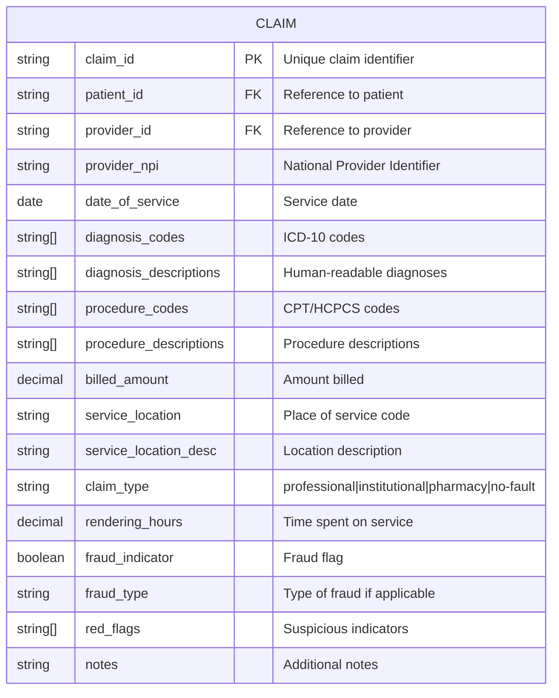

### 2. Patient Entity

Represents insured individuals filing claims.

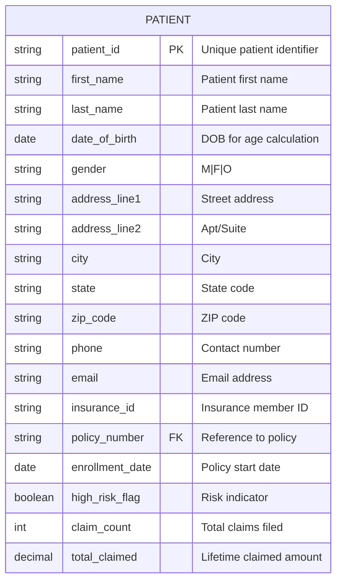

### 3. Provider Entity

Healthcare providers submitting claims.

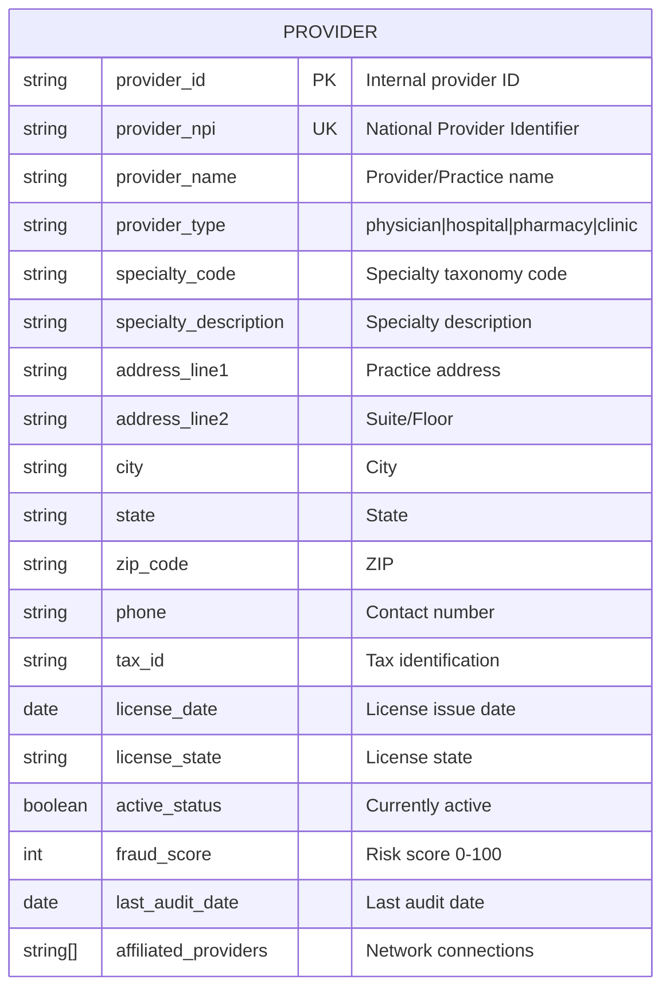

### 4. Policy Entity

Insurance policy information.

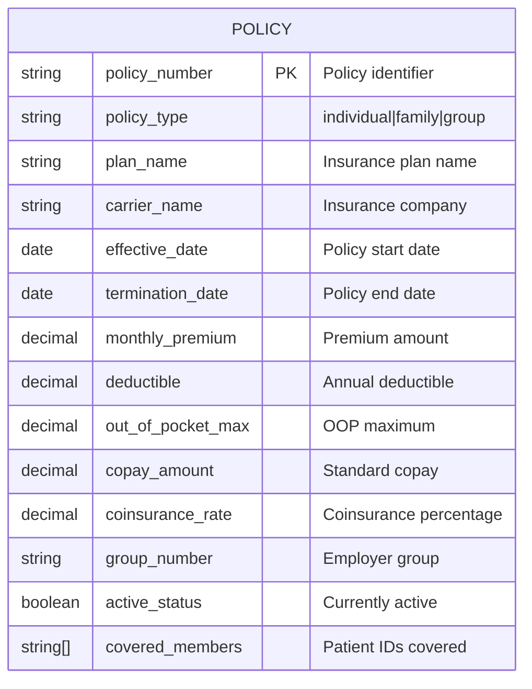

### 5. Pharmacy Claim Entity

Specialized entity for prescription claims.

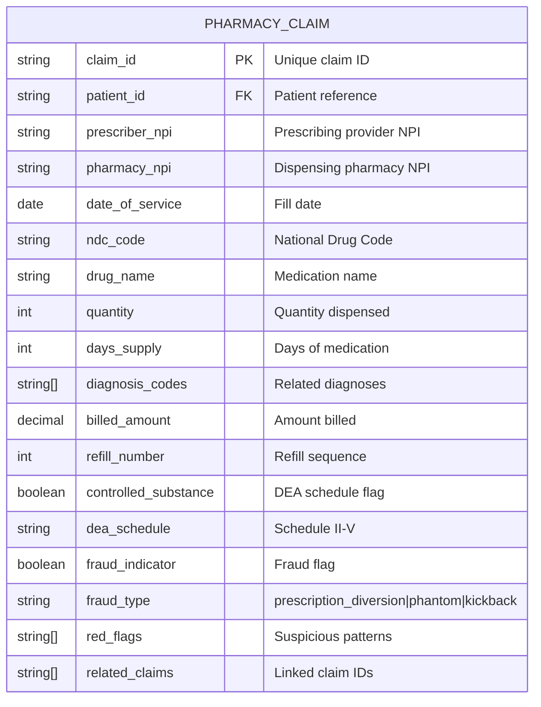

### 6. No-Fault Claim Entity

Auto accident insurance claims.

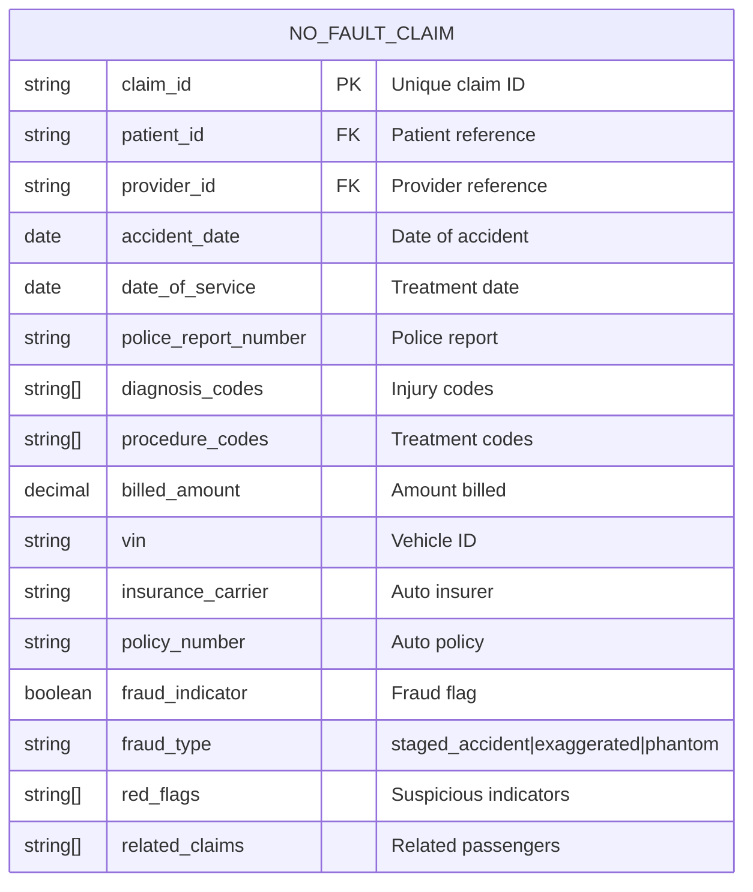

---

## Fraud Indicator Models

### 1. Fraud Pattern Entity

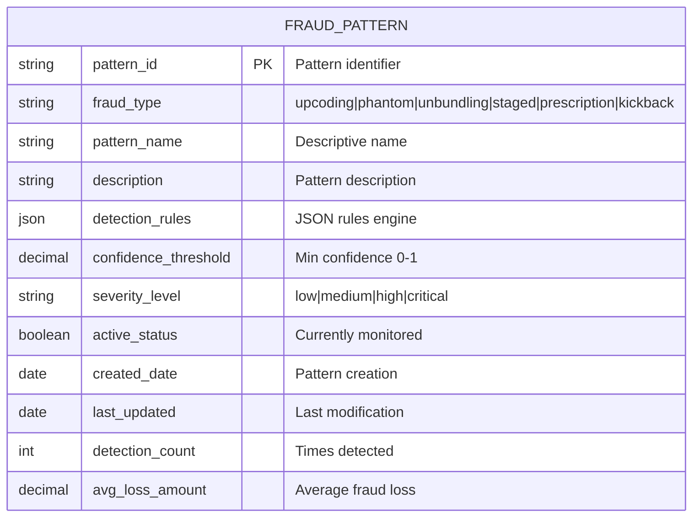

### 2. Red Flag Entity

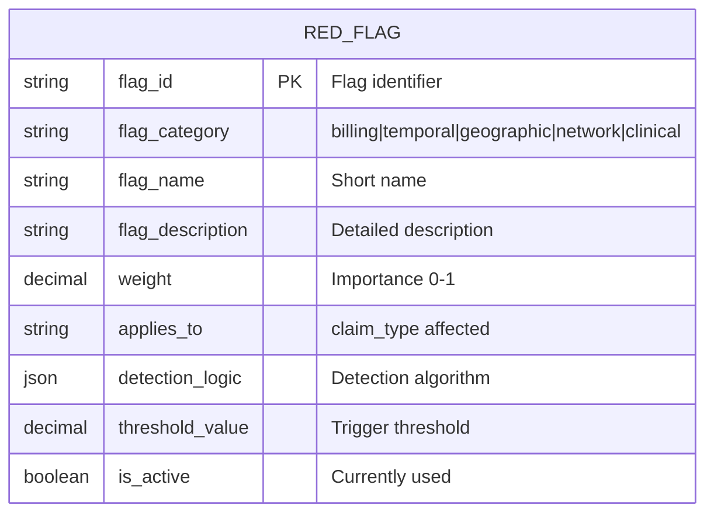

### 3. Fraud Investigation Entity

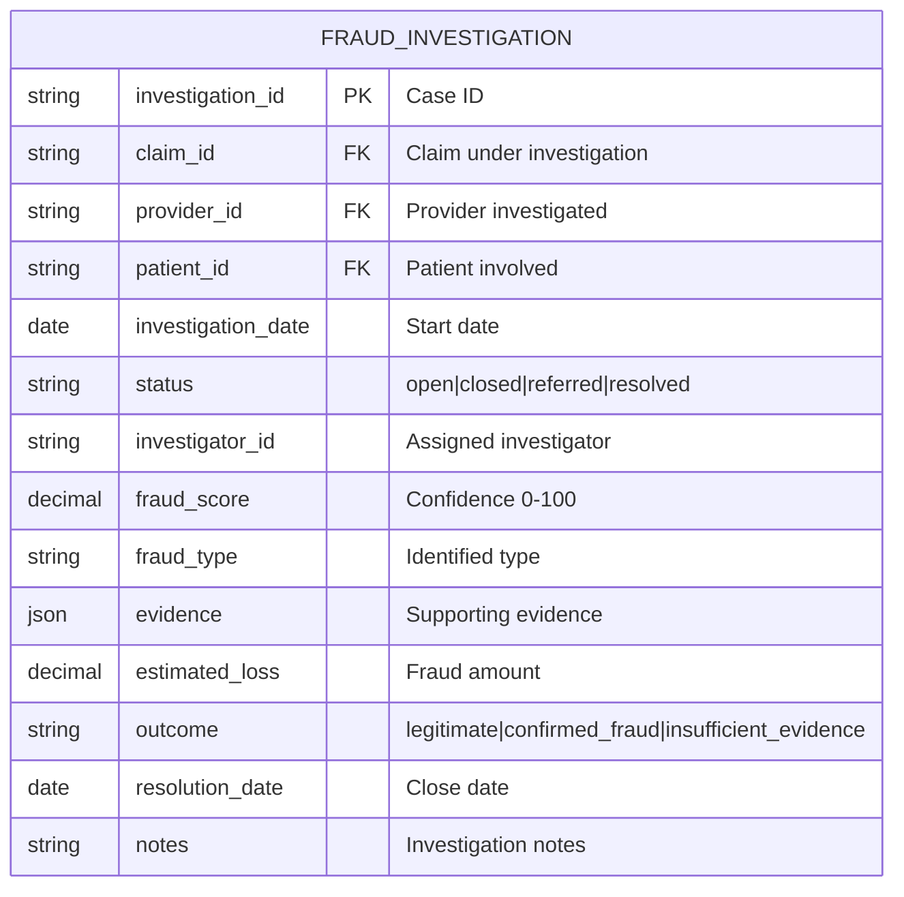

---

## Data Validation Rules

### 1. Claim Validation Rules

```json
{
  "claim_validation_rules": {
    "claim_id": {
      "pattern": "^(CLM|RX|NF)-\\d{4}-[A-Z0-9]{6}$",
      "required": true,
      "unique": true
    },
    "provider_npi": {
      "pattern": "^\\d{10}$",
      "required": true,
      "luhn_check": true
    },
    "date_of_service": {
      "required": true,
      "not_future": true,
      "within_days": 365
    },
    "diagnosis_codes": {
      "min_items": 1,
      "max_items": 12,
      "icd10_valid": true
    },
    "procedure_codes": {
      "min_items": 1,
      "max_items": 10,
      "cpt_valid": true
    },
    "billed_amount": {
      "min": 0.01,
      "max": 999999.99,
      "decimal_places": 2
    }
  }
}
```

### 2. Business Rules

```json
{
  "business_rules": {
    "temporal_rules": {
      "same_day_claim_limit": 3,
      "max_hours_billed_per_day": 24,
      "service_before_accident": "reject",
      "future_date_claims": "reject"
    },
    "geographic_rules": {
      "max_distance_per_day": 500,
      "concurrent_location_check": true,
      "out_of_state_threshold": 0.2
    },
    "billing_rules": {
      "upcoding_variance_threshold": 3.5,
      "unbundling_detection": true,
      "duplicate_claim_window": 30,
      "max_daily_billing": 50000
    },
    "prescription_rules": {
      "early_refill_days": 5,
      "max_prescribers_30_days": 3,
      "max_pharmacies_30_days": 3,
      "controlled_substance_monitoring": true
    },
    "network_rules": {
      "referral_concentration_max": 0.85,
      "kickback_pattern_threshold": 0.7,
      "circular_referral_detection": true
    }
  }
}
```

### 3. Data Quality Constraints

```sql
-- Example SQL constraints
ALTER TABLE claims ADD CONSTRAINT chk_claim_amount
  CHECK (billed_amount > 0 AND billed_amount < 1000000);

ALTER TABLE claims ADD CONSTRAINT chk_service_date
  CHECK (date_of_service <= CURRENT_DATE);

ALTER TABLE providers ADD CONSTRAINT chk_npi_format
  CHECK (LENGTH(provider_npi) = 10 AND provider_npi ~ '^[0-9]+$');

ALTER TABLE patients ADD CONSTRAINT chk_age
  CHECK (DATE_PART('year', AGE(date_of_birth)) BETWEEN 0 AND 120);
```

---

## Entity Relationships

### ER Diagram

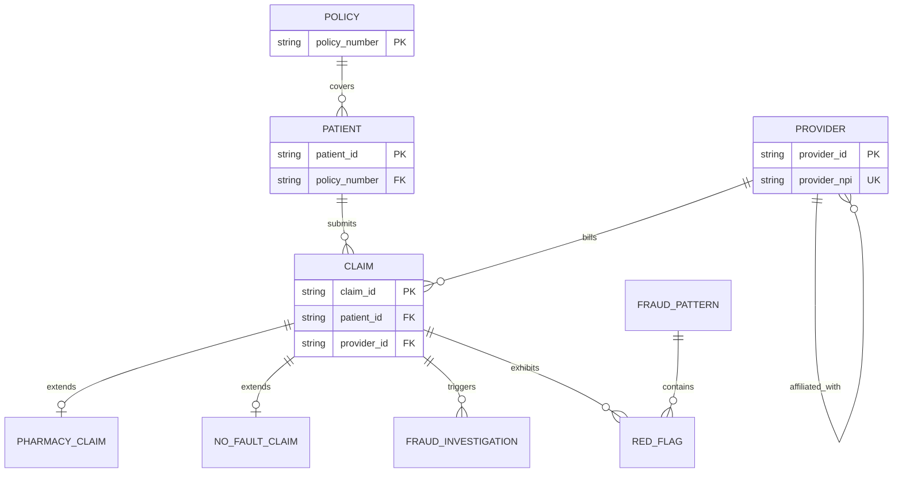

### Relationship Cardinalities

| Relationship | Type | Cardinality | Description |
|-------------|------|-------------|-------------|
| Patient → Claim | 1:N | One-to-Many | A patient can have multiple claims |
| Provider → Claim | 1:N | One-to-Many | A provider can submit multiple claims |
| Policy → Patient | 1:N | One-to-Many | A policy can cover multiple patients |
| Claim → Investigation | 1:1 | One-to-One | Each investigation links to one claim |
| Provider → Provider | N:N | Many-to-Many | Providers can be affiliated |
| Claim → Red Flag | 1:N | One-to-Many | A claim can have multiple red flags |

---

## API Models

### 1. Fraud Detection Request

```json
{
  "$schema": "http://json-schema.org/draft-07/schema#",
  "title": "FraudDetectionRequest",
  "type": "object",
  "required": ["claim", "context"],
  "properties": {
    "claim": {
      "type": "object",
      "required": ["claim_id", "patient_id", "provider_npi", "billed_amount"],
      "properties": {
        "claim_id": {
          "type": "string",
          "pattern": "^[A-Z]{2,3}-\\d{4}-[A-Z0-9]{6}$"
        },
        "patient_id": {
          "type": "string"
        },
        "provider_npi": {
          "type": "string",
          "pattern": "^\\d{10}$"
        },
        "date_of_service": {
          "type": "string",
          "format": "date"
        },
        "diagnosis_codes": {
          "type": "array",
          "items": {
            "type": "string",
            "pattern": "^[A-Z][0-9]{2}\\.[0-9X]{1,4}$"
          }
        },
        "procedure_codes": {
          "type": "array",
          "items": {
            "type": "string",
            "pattern": "^\\d{5}$"
          }
        },
        "billed_amount": {
          "type": "number",
          "minimum": 0.01
        }
      }
    },
    "context": {
      "type": "object",
      "properties": {
        "check_history": {
          "type": "boolean",
          "default": true
        },
        "include_network_analysis": {
          "type": "boolean",
          "default": false
        },
        "urgency": {
          "type": "string",
          "enum": ["real-time", "batch", "retrospective"],
          "default": "real-time"
        }
      }
    }
  }
}
```

### 2. Fraud Detection Response

```json
{
  "$schema": "http://json-schema.org/draft-07/schema#",
  "title": "FraudDetectionResponse",
  "type": "object",
  "required": ["claim_id", "fraud_score", "fraud_indicator", "processing_time_ms"],
  "properties": {
    "claim_id": {
      "type": "string"
    },
    "fraud_score": {
      "type": "number",
      "minimum": 0,
      "maximum": 100,
      "description": "Fraud probability score 0-100"
    },
    "fraud_indicator": {
      "type": "boolean",
      "description": "Binary fraud classification"
    },
    "fraud_type": {
      "type": "string",
      "enum": ["upcoding", "phantom_billing", "unbundling", "staged_accident", "prescription_fraud", "kickback", "none"],
      "description": "Identified fraud pattern"
    },
    "confidence_level": {
      "type": "string",
      "enum": ["low", "medium", "high", "very_high"],
      "description": "Confidence in detection"
    },
    "red_flags": {
      "type": "array",
      "items": {
        "type": "object",
        "properties": {
          "flag_id": {
            "type": "string"
          },
          "flag_name": {
            "type": "string"
          },
          "severity": {
            "type": "string",
            "enum": ["low", "medium", "high"]
          },
          "description": {
            "type": "string"
          }
        }
      }
    },
    "recommendations": {
      "type": "array",
      "items": {
        "type": "string"
      },
      "description": "Recommended actions"
    },
    "related_claims": {
      "type": "array",
      "items": {
        "type": "string"
      },
      "description": "Related suspicious claims"
    },
    "processing_time_ms": {
      "type": "integer",
      "description": "Processing time in milliseconds"
    },
    "model_version": {
      "type": "string",
      "description": "Detection model version used"
    }
  }
}
```

### 3. Batch Processing Request

```json
{
  "$schema": "http://json-schema.org/draft-07/schema#",
  "title": "BatchFraudDetectionRequest",
  "type": "object",
  "required": ["batch_id", "claims", "processing_options"],
  "properties": {
    "batch_id": {
      "type": "string",
      "description": "Unique batch identifier"
    },
    "claims": {
      "type": "array",
      "minItems": 1,
      "maxItems": 10000,
      "items": {
        "$ref": "#/definitions/Claim"
      }
    },
    "processing_options": {
      "type": "object",
      "properties": {
        "priority": {
          "type": "string",
          "enum": ["low", "normal", "high"],
          "default": "normal"
        },
        "parallel_processing": {
          "type": "boolean",
          "default": true
        },
        "max_processing_time_hours": {
          "type": "number",
          "default": 4,
          "maximum": 24
        },
        "include_network_analysis": {
          "type": "boolean",
          "default": true
        },
        "output_format": {
          "type": "string",
          "enum": ["json", "csv", "parquet"],
          "default": "json"
        }
      }
    }
  }
}
```

### 4. Provider Risk Assessment API

```json
{
  "$schema": "http://json-schema.org/draft-07/schema#",
  "title": "ProviderRiskAssessmentResponse",
  "type": "object",
  "properties": {
    "provider_npi": {
      "type": "string"
    },
    "risk_score": {
      "type": "integer",
      "minimum": 0,
      "maximum": 100
    },
    "risk_factors": {
      "type": "array",
      "items": {
        "type": "object",
        "properties": {
          "factor": {
            "type": "string"
          },
          "score_contribution": {
            "type": "number"
          },
          "percentile": {
            "type": "number"
          }
        }
      }
    },
    "billing_patterns": {
      "type": "object",
      "properties": {
        "avg_daily_claims": {
          "type": "number"
        },
        "avg_claim_amount": {
          "type": "number"
        },
        "upcoding_frequency": {
          "type": "number"
        },
        "referral_concentration": {
          "type": "number"
        }
      }
    },
    "peer_comparison": {
      "type": "object",
      "properties": {
        "specialty_avg_billing": {
          "type": "number"
        },
        "percentile_rank": {
          "type": "number"
        },
        "standard_deviations": {
          "type": "number"
        }
      }
    },
    "investigation_history": {
      "type": "object",
      "properties": {
        "total_investigations": {
          "type": "integer"
        },
        "confirmed_fraud_cases": {
          "type": "integer"
        },
        "last_investigation_date": {
          "type": "string",
          "format": "date"
        }
      }
    }
  }
}
```

---

## JSON Schemas

### 1. Complete Claim Schema

```json
{
  "$schema": "http://json-schema.org/draft-07/schema#",
  "$id": "https://insurance-fraud-detection.com/schemas/claim.json",
  "title": "InsuranceClaim",
  "type": "object",
  "required": [
    "claim_id",
    "patient_id",
    "provider_id",
    "provider_npi",
    "date_of_service",
    "diagnosis_codes",
    "procedure_codes",
    "billed_amount",
    "claim_type"
  ],
  "properties": {
    "claim_id": {
      "type": "string",
      "pattern": "^(CLM|RX|NF)-\\d{4}-[A-Z0-9]{6}$",
      "description": "Unique claim identifier"
    },
    "patient_id": {
      "type": "string",
      "pattern": "^PAT-\\d{5}$",
      "description": "Patient identifier"
    },
    "provider_id": {
      "type": "string",
      "pattern": "^PRV-[A-Z0-9-]+$",
      "description": "Provider identifier"
    },
    "provider_npi": {
      "type": "string",
      "pattern": "^\\d{10}$",
      "description": "National Provider Identifier"
    },
    "date_of_service": {
      "type": "string",
      "format": "date",
      "description": "Date service was rendered"
    },
    "diagnosis_codes": {
      "type": "array",
      "minItems": 1,
      "maxItems": 12,
      "items": {
        "type": "string",
        "pattern": "^[A-Z][0-9]{2}(\\.[0-9X]{1,4})?$"
      },
      "description": "ICD-10 diagnosis codes"
    },
    "diagnosis_descriptions": {
      "type": "array",
      "items": {
        "type": "string"
      },
      "description": "Human-readable diagnosis descriptions"
    },
    "procedure_codes": {
      "type": "array",
      "minItems": 1,
      "maxItems": 10,
      "items": {
        "type": "string",
        "pattern": "^\\d{5}$"
      },
      "description": "CPT procedure codes"
    },
    "procedure_descriptions": {
      "type": "array",
      "items": {
        "type": "string"
      },
      "description": "Human-readable procedure descriptions"
    },
    "billed_amount": {
      "type": "number",
      "minimum": 0.01,
      "maximum": 999999.99,
      "multipleOf": 0.01,
      "description": "Amount billed for services"
    },
    "service_location": {
      "type": "string",
      "pattern": "^\\d{2}$",
      "description": "Place of service code"
    },
    "service_location_desc": {
      "type": "string",
      "description": "Place of service description"
    },
    "claim_type": {
      "type": "string",
      "enum": ["professional", "institutional", "pharmacy", "no-fault"],
      "description": "Type of claim"
    },
    "rendering_hours": {
      "type": "number",
      "minimum": 0,
      "maximum": 24,
      "description": "Hours spent rendering service"
    },
    "fraud_indicator": {
      "type": "boolean",
      "description": "Fraud detection flag"
    },
    "fraud_type": {
      "type": "string",
      "enum": ["upcoding", "phantom_billing", "unbundling", "staged_accident", "prescription_fraud", "kickback"],
      "description": "Type of fraud detected"
    },
    "red_flags": {
      "type": "array",
      "items": {
        "type": "string"
      },
      "description": "List of suspicious indicators"
    },
    "notes": {
      "type": "string",
      "description": "Additional claim notes"
    }
  },
  "if": {
    "properties": {
      "claim_type": {
        "const": "pharmacy"
      }
    }
  },
  "then": {
    "required": ["ndc_code", "quantity", "days_supply"]
  },
  "if": {
    "properties": {
      "claim_type": {
        "const": "no-fault"
      }
    }
  },
  "then": {
    "required": ["accident_date", "police_report_number"]
  }
}
```

### 2. Fraud Pattern Configuration Schema

```json
{
  "$schema": "http://json-schema.org/draft-07/schema#",
  "$id": "https://insurance-fraud-detection.com/schemas/fraud-pattern.json",
  "title": "FraudPatternConfiguration",
  "type": "object",
  "required": ["pattern_id", "pattern_name", "fraud_type", "detection_rules"],
  "properties": {
    "pattern_id": {
      "type": "string",
      "pattern": "^FP-[A-Z0-9]{6}$"
    },
    "pattern_name": {
      "type": "string",
      "maxLength": 100
    },
    "fraud_type": {
      "type": "string",
      "enum": ["upcoding", "phantom_billing", "unbundling", "staged_accident", "prescription_fraud", "kickback", "network_fraud"]
    },
    "detection_rules": {
      "type": "object",
      "properties": {
        "conditions": {
          "type": "array",
          "items": {
            "type": "object",
            "properties": {
              "field": {
                "type": "string"
              },
              "operator": {
                "type": "string",
                "enum": ["equals", "not_equals", "greater_than", "less_than", "contains", "regex", "in", "not_in"]
              },
              "value": {},
              "weight": {
                "type": "number",
                "minimum": 0,
                "maximum": 1
              }
            }
          }
        },
        "threshold": {
          "type": "number",
          "minimum": 0,
          "maximum": 1
        },
        "aggregation": {
          "type": "string",
          "enum": ["all", "any", "weighted_sum", "majority"]
        }
      }
    },
    "severity_level": {
      "type": "string",
      "enum": ["low", "medium", "high", "critical"]
    },
    "active_status": {
      "type": "boolean",
      "default": true
    }
  }
}
```

---

## Data Pipeline Architecture

### Ingestion Flow

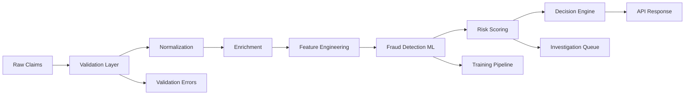

### Real-time Processing Requirements

| Metric | Target | Critical Threshold |
|--------|--------|-------------------|
| Latency | <100ms | <500ms |
| Throughput | 1000 claims/sec | 500 claims/sec |
| Availability | 99.9% | 99.5% |
| False Positive Rate | <3.8% | <5% |
| Detection Rate | >92% | >85% |

---

## Data Retention and Archival

### Retention Policies

```json
{
  "retention_policies": {
    "active_claims": {
      "duration_days": 90,
      "storage": "hot",
      "indexes": ["claim_id", "patient_id", "provider_npi", "date_of_service"]
    },
    "historical_claims": {
      "duration_days": 2555,
      "storage": "warm",
      "compression": "snappy",
      "partitioning": "monthly"
    },
    "fraud_investigations": {
      "duration_days": 3650,
      "storage": "cold",
      "encryption": "AES-256",
      "compliance": "HIPAA"
    },
    "audit_logs": {
      "duration_days": 2555,
      "storage": "immutable",
      "format": "parquet"
    }
  }
}
```

---

## Security and Compliance

### Data Classification

| Data Type | Classification | Encryption | Access Control |
|-----------|---------------|------------|----------------|
| Patient PII | Highly Sensitive | AES-256 | Role-based |
| Provider Information | Sensitive | AES-256 | Role-based |
| Claim Details | Sensitive | AES-256 | Attribute-based |
| Fraud Scores | Confidential | TLS 1.3 | Need-to-know |
| Investigation Records | Highly Sensitive | AES-256 + HSM | Restricted |

### HIPAA Compliance Requirements

1. **Data Encryption**: All PHI encrypted at rest and in transit
2. **Access Controls**: Multi-factor authentication required
3. **Audit Logging**: All data access logged and monitored
4. **Data Minimization**: Only necessary fields exposed via API
5. **Breach Notification**: Automated alerting within 60 days

---

## Implementation Recommendations

### 1. Database Technology Stack

- **Primary Database**: PostgreSQL 14+ with JSONB support
- **Cache Layer**: Redis for fraud scores and patterns
- **Search Engine**: Elasticsearch for investigation queries
- **Time Series**: TimescaleDB for temporal analysis
- **Graph Database**: Neo4j for network fraud detection

### 2. API Framework

- **REST API**: FastAPI with Pydantic validation
- **GraphQL**: Optional for complex queries
- **Streaming**: Kafka for real-time processing
- **Batch Processing**: Apache Spark for historical analysis

### 3. Monitoring and Observability

- **Metrics**: Prometheus + Grafana
- **Logging**: ELK Stack (Elasticsearch, Logstash, Kibana)
- **Tracing**: Jaeger for distributed tracing
- **Alerting**: PagerDuty integration

---

## Appendix: Sample Data Examples

### Valid Medical Claim

```json
{
  "claim_id": "CLM-2024-001234",
  "patient_id": "PAT-78901",
  "provider_id": "PRV-45678",
  "provider_npi": "1234567890",
  "date_of_service": "2024-03-15",
  "diagnosis_codes": ["E11.9", "I10"],
  "diagnosis_descriptions": ["Type 2 diabetes mellitus", "Hypertension"],
  "procedure_codes": ["99213"],
  "procedure_descriptions": ["Office visit, established patient"],
  "billed_amount": 125.00,
  "service_location": "11",
  "service_location_desc": "Office",
  "claim_type": "professional",
  "rendering_hours": 0.25,
  "fraud_indicator": false,
  "notes": "Routine diabetes follow-up"
}
```

### Fraudulent Upcoding Claim

```json
{
  "claim_id": "CLM-2024-F01001",
  "patient_id": "PAT-80001",
  "provider_id": "PRV-FRAUD-001",
  "provider_npi": "9999999001",
  "date_of_service": "2024-03-15",
  "diagnosis_codes": ["J00"],
  "diagnosis_descriptions": ["Common cold"],
  "procedure_codes": ["99215"],
  "procedure_descriptions": ["Office visit, high complexity"],
  "billed_amount": 325.00,
  "actual_service": "99212",
  "actual_amount": 75.00,
  "service_location": "11",
  "claim_type": "professional",
  "rendering_hours": 0.75,
  "fraud_indicator": true,
  "fraud_type": "upcoding",
  "red_flags": [
    "Simple diagnosis billed at highest complexity",
    "Provider bills 90% of visits as 99215",
    "Visit duration inconsistent with complexity"
  ]
}
```

---

## Version History

| Version | Date | Author | Changes |
|---------|------|--------|---------|
| 1.0.0 | 2024-09-18 | System | Initial comprehensive data model documentation |

---

## Contact Information

For questions or clarifications about this data model:
- Technical Architecture: architecture@fraud-detection.com
- Data Governance: data-governance@fraud-detection.com
- API Support: api-support@fraud-detection.com